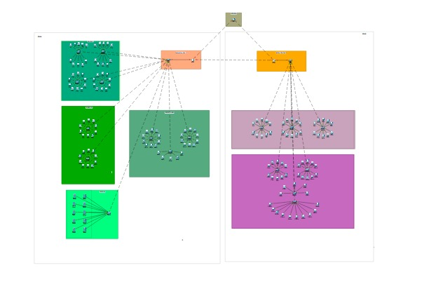

# [Desain Topologi & Skema Pengalamatan] - [Pekan 10]

## Anggota Kelompok dan Peran
- Meiske Handayani (10231052) - Network Architect
- Muhammad Ariel Rayhan (10231058) - Network Engineer
- Nilam Ayu Nandastari Romdoni (10231070) - Network service Specialist 
- Ranaya Chintya Mahitsa (10231078) - Security & Documentation Specialist 

## Isi Laporan
- Diagram topologi fisik dan logis (gambar yang diunggah dalam markdown dengan penjelasan mendetail).

- Tabel pengalamatan IP (subnet, VLAN ID, gateway, range, dsb).

- Daftar perangkat yang dibutuhkan (router, switch, server, dsb).
Daftar Perangkat yang dibutuhkan dalam komponen ini adalah sebagai berikut : 
**A. Gedung A**
1. Departemen IT 
- 40 Pc 
- 4 Switch
- Kabel Cross Over

2. Departemen SDM 
- 20 Pc
- 2 Switch
- Kabel Cross Over

3. Departemen Keuangan 
- 25 Pc
- 3 Switch
- Kabel Cross Over

4. Server Farm 
- 10 Server 
- 1 Switch
- Kabel Straight Through

5. 1 Main Router dan 1 Main Switch di Gedung A

**B. Gedung B**
1. Departemen Marketing 
- 30 Pc
- 3 Switch
- Kabel Cross Over

2. Departemen Operasional 
- 35 Pc
- 4 Switch 
- Kabel Cross Over

3.  1 Main Router dan 1 Main Switch di Gedung B

Untuk kedua gedung memiliki 1 router utama yang menjadi ibu dari kedua main router di masing-masing gedung.

- Rencana penerapan VLAN (VLAN ID, nama, tujuan).
