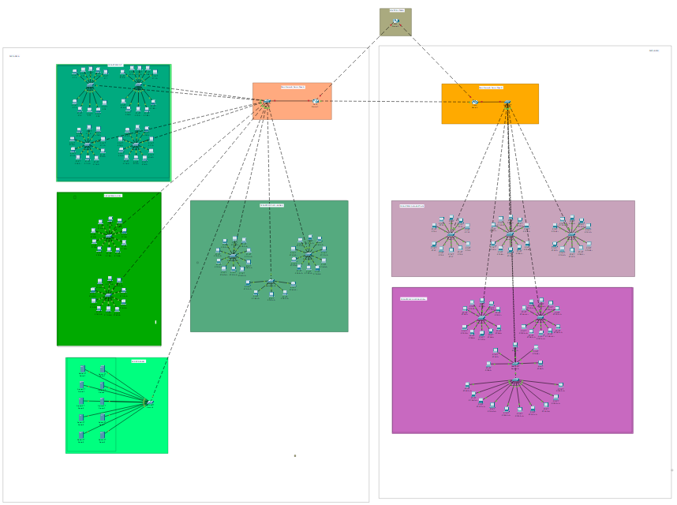
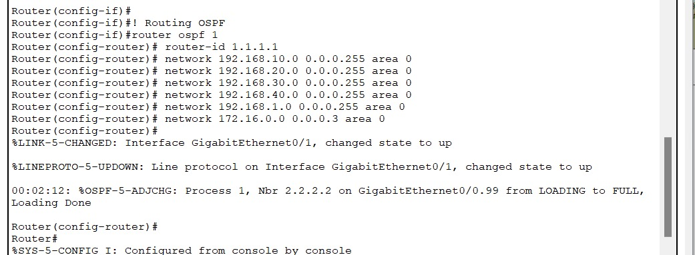
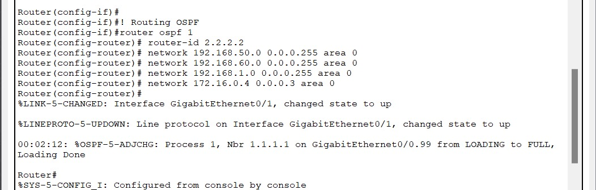
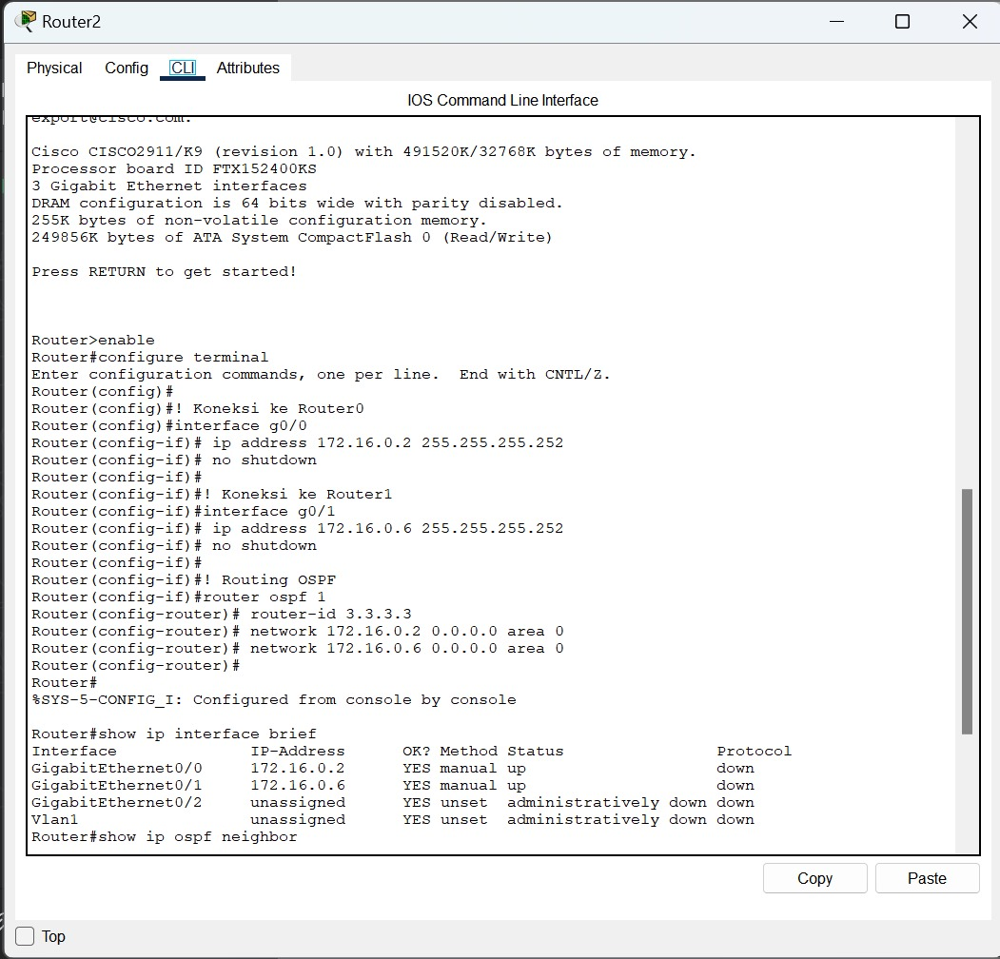

# [Implementasi Routing & WAN] - [Pekan 12]

## Anggota Kelompok dan Peran
- Meiske Handayani (10231052) - Network Architect
- Muhammad Ariel Rayhan (10231058) - Network Engineer
- Nilam Ayu Nandastari Romdoni (10231070) - Network service Specialist 
- Ranaya Chintya Mahitsa (10231078) - Security & Documentation Specialist 

## Isi Laporan





```bash
Router (config-if)#
Router (config-if)#! Routing OSPF
Router (config-if)#router ospf 1
Router (config-router)# router-id 1.1.1.1
Router (config-router)# network 192.168.10.0 0.0.0.255 area 0
Router (config-router)# network 192.168.20.0 0.0.0.255 area 0
Router(config-router)# network 192.168.30.0 0.0.0.255 area 0
Router(config-router)# network 192.168.40.0 0.0.0.255 area 0
Router(config-router)# network 192.168.1.0 0.0.0.255 area 0
Router (config-router)# network 172.16.0.0 0.0.0.3 area 0
Router(config-router)#
LINK-5-CHANGED: Interface GigabitEthernet0/1, changed state to up
LINK-5-CHANGED: Interface GigabitEthernet0/1, changed state to up

%LINEPROTO-5-UPDOWN: Line protocol on Interface GigabitEthernet0/1, changed state to up

00:02:12: %OSPF-5-ADJCHG: Process 1, Nbr 2.2.2.2 on GigabitEthernet0/0.99 from LOADING to FULL, Loading Done
Router (config-router)#
Router#
%SYS-5-CONFIG I: Configured from console by console
```

Router ini dikonfigurasi dengan OSPF proses ID 1. Router ID diset ke 1.1.1.1. Router mengiklankan beberapa network ke area OSPF 0:
192.168.10.0/24
192.168.20.0/24
192.168.30.0/24
192.168.40.0/24
192.168.1.0/24
172.16.0.0/30
Terlihat bahwa interface GigabitEthernet0/1 telah aktif (state to up). Router ini berhasil membentuk OSPF adjacency dengan router lain yang memiliki Router ID 2.2.2.2 pada interface GigabitEthernet0/0.



```bash
Router (config-if)#
Router (config-if)#! Routing OSPF
Router (config-if)#router ospf 1
Router (config-router)# router-id 2.2.2.2
Router(config-router)# network 192.168.50.0 0.0.0.255 area 0
Router (config-router)# network 192.168.60.0 0.0.0.255 area 0
Router (config-router)# network 192.168.1.0 0.0.0.255 area 0
Router (config-router)# network 172.16.0.4 0.0.0.3 area 0
Router (config-router)#
%LINK-5-CHANGED: Interface GigabitEthernet0/1, changed state to up
%LINEPROTO-5-UPDOWN: Line protocol on Interface GigabitEthernet0/1, changed state to up
00:02:12: %OSPF-5-ADJCHG: Process 1, Nbr 1.1.1.1 on GigabitEthernet0/0.99 from LOADING to FULL,
Loading Done
Router#
%SYS-5-CONFIG I: Configured from console by console
```

Router ini juga menggunakan OSPF dengan proses ID 1. Router ID diset ke 2.2.2.2. Mengiklankan network:
192.168.50.0/24
192.168.60.0/24
192.168.1.0/24
172.16.0.4/30
Sama seperti router sebelumnya, interface GigabitEthernet0/1 diaktifkan. Router ini juga berhasil membentuk adjacency OSPF dengan router 1.1.1.1. Router ini merupakan router tetangga dari RouterGedA, dan mereka saling bertukar informasi OSPF.


```bash
Router>enable
Router#configure terminal
Enter configuration commands, one per line. End with CNTL/Z.
Router (config)#
Router (config)#! Koneksi ke Router0
Router (config)#interface g0/0
Router(config-if)# ip address 172.16.0.2 255.255.255.252
Router(config-if)# no shutdown
Router (config-if)#
Router(config-if)#! Koneksi ke Routerl
Router (config-if)#interface g0/1
Router (config-if)# ip address 172.16.0.6 255.255.255.252
Router (config-if)# no shutdown
Router(config-if)#
Router(config-if)#! Routing OSPF
Router (config-if)#router ospf 1
Router(config-router) router-id 3.3.3.3
Router (config-router)# network 172.16.0.2 0.0.0.0 area 0
Router(config-router)# network 172.16.0.6 0.0.0.0 area 0
Router(config-router)#
Router#

SYS-5-CONFIG_I: Configured from console by console

Router#show ip interface brief
Interface
GigabitEthernet0/0
GigabitEthernet0/1
GigabitEthernet0/2
IP-Address
OK? Method Status
Protocol
172.16.0.2
YES manual up
down
172.16.0.6
YES manual up
down
unassigned
YES unset
administratively down down
Vlan1
unassigned
YES unset administratively down down
Router#show ip ospf neighbor
```
Ini merupakan router utama yang terhubung ke dua router lainnya (Router0 dan Router1) melalui:

GigabitEthernet0/0 ke 172.16.0.2/30
GigabitEthernet0/1 ke 172.16.0.6/30
Router ID diset ke 3.3.3.3.

Network OSPF yang dikonfigurasi:
172.16.0.2/30
172.16.0.6/30

Perintah show ip interface brief menunjukkan bahwa interface sudah UP, tapi: Protokol down, yang artinya belum ada konektivitas OSPF pada layer 3. Perintah show ip ospf neighbor tidak menunjukkan neighbor, artinya belum ada tetangga OSPF terbentuk. Router ini belum berhasil membentuk hubungan OSPF dengan router-router lain. Masalah kemungkinan ada pada kabel, IP address, atau OSPF belum berjalan di router tetangga.

Routing statis adalah metode routing yang dikonfigurasi secara manual oleh administrator jaringan, cocok untuk jaringan kecil yang topologinya tidak sering berubah karena lebih aman, ringan, dan tidak menggunakan bandwidth tambahan. Sebaliknya, routing dinamis seperti OSPF dan EIGRP lebih cocok untuk jaringan besar dan kompleks karena dapat menyesuaikan secara otomatis terhadap perubahan topologi, mempercepat proses failover, serta mengurangi beban konfigurasi manual. Meskipun routing dinamis membutuhkan lebih banyak sumber daya CPU dan bandwidth untuk bertukar informasi antar-router, fleksibilitas dan skalabilitasnya menjadikannya pilihan utama di lingkungan jaringan yang dinamis dan terus berkembang.
