# [Implementasi Layanan Jaringan] - [Pekan 13]

## Anggota Kelompok dan Peran
- Meiske Handayani (10231052) - Network Architect
- Muhammad Ariel Rayhan (10231058) - Network Engineer
- Nilam Ayu Nandastari Romdoni (10231070) - Network service Specialist 
- Ranaya Chintya Mahitsa (10231078) - Security & Documentation Specialist 

## Isi Laporan

1. Konfigurasi DHCP Server untuk setiap departemen.

**Gedung A**

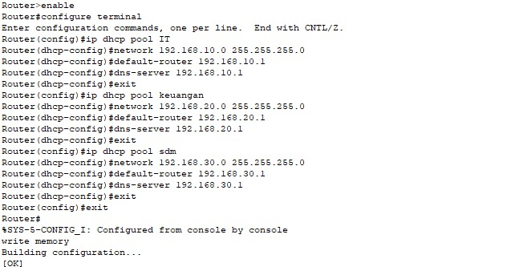

```bash
Router>enable
Router#configure terminal
Enter configuration commands, one per line. End with CNTL/Z.
Router(config)#ip dhcp pool IT
Router (dhcp-config)#network 192.168.10.0 255.255.255.0
Router (dhcp-config)#default-router 192.168.10.1
Router (dhcp-config)#dns-server 192.168.10.1
Router (dhcp-config)#exit
Router(config)#ip dhcp pool keuangan
Router (dhcp-config)#network 192.168.20.0 255.255.255.0
Router (dhcp-config)#default-router 192.168.20.1
Router (dhcp-config)#dns-server 192.168.20.1
Router (dhcp-config)#exit
Router(config)#ip dhcp pool sdm
Router (dhcp-config)#network 192.168.30.0 255.255.255.0
Router (dhcp-config)#default-router 192.168.30.1
Router (dhcp-config)#dns-server 192.168.30.1
Router (dhcp-config)#exit
Router(config)#exit
Router#
SYS-5-CONFIG_I: Configured from console by console
write memory
Building configuration...
[OK]
```

Konfigurasi DHCP di atas bertujuan untuk mengatur pembagian alamat IP secara otomatis oleh router kepada perangkat-perangkat yang terhubung ke jaringan, dengan membagi jaringan menjadi tiga pool berdasarkan departemen, yaitu IT, Keuangan, dan SDM. Setiap pool memiliki subnet berbeda: IT menggunakan 192.168.10.0/24, Keuangan 192.168.20.0/24, dan SDM 192.168.30.0/24. Dalam setiap pool, ditentukan gateway (default-router) dan DNS server yang disesuaikan dengan jaringan masing-masing, misalnya 192.168.10.1 untuk IT. Dengan konfigurasi ini, perangkat klien di setiap departemen akan otomatis mendapatkan IP, gateway, dan DNS yang sesuai, tanpa perlu disetting manual. Hal ini memudahkan pengelolaan jaringan, meningkatkan efisiensi, dan memisahkan lalu lintas data antar departemen demi keamanan dan kejelasan struktur jaringan. Setelah konfigurasi selesai, perintah `write memory` digunakan untuk menyimpan pengaturan agar tetap aktif meskipun router dimatikan atau direstart.

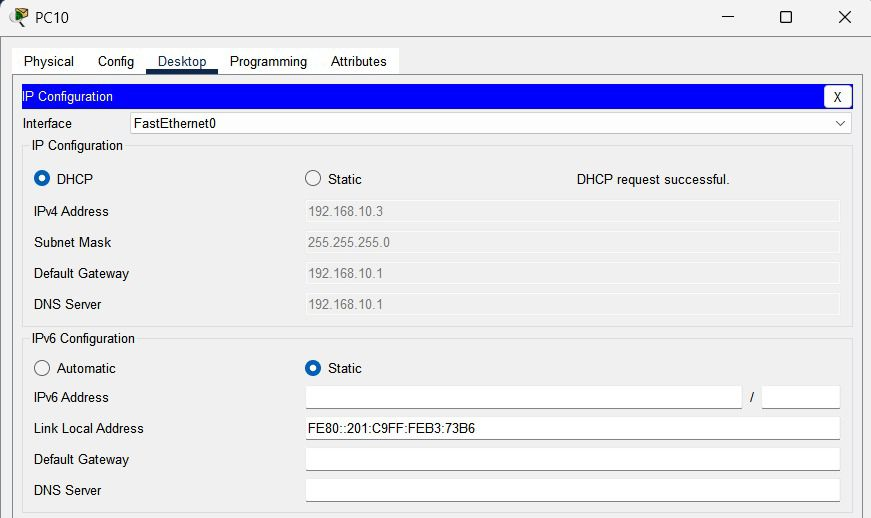

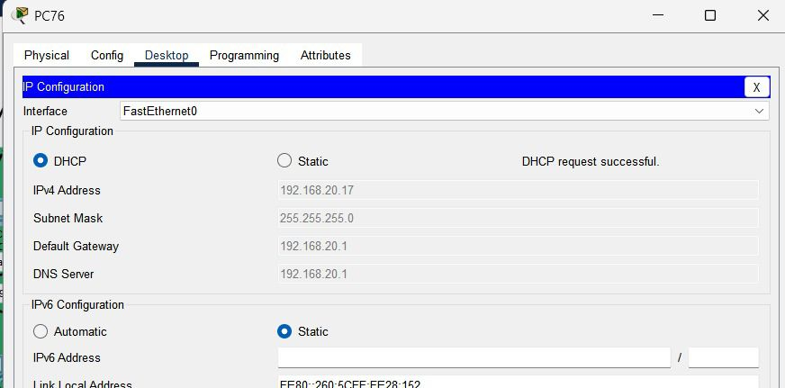

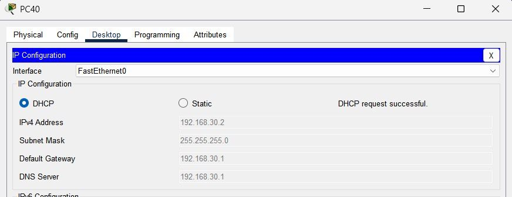

**Gedung B**

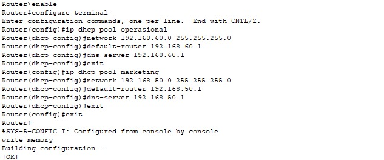

```bash
Router>enable
Router#configure terminal
Enter configuration commands, one per line. End with CNTL/Z.
Router(config)#ip dhcp pool operasional
Router (dhcp-config)#network 192.168.60.0 255.255.255.0
Router (dhcp-config)#default-router 192.168.60.1
Router (dhcp-config)#dns-server 192.168.60.1
Router (dhcp-config)#exit
Router(config)#ip dhcp pool marketing
Router (dhcp-config)#network 192.168.50.0 255.255.255.0
Router (dhcp-config)#default-router 192.168.50.1
Router (dhcp-config)#dns-server 192.168.50.1
Router (dhcp-config)#exit
Router(config)#exit
Router#

SYS-5-CONFIG_I: Configured from console by console
write memory
Building configuration...
[OK]
```
Konfigurasi di atas merupakan pengaturan layanan DHCP (Dynamic Host Configuration Protocol) pada router Cisco untuk dua segmen jaringan, yaitu "operasional" dan "marketing". Untuk jaringan "operasional", digunakan network `192.168.60.0` dengan subnet mask `255.255.255.0`, dan klien akan diberikan alamat gateway (`default-router`) serta DNS server `192.168.60.1`. Sementara untuk jaringan "marketing", digunakan network `192.168.50.0/24`, dengan gateway dan DNS server `192.168.50.1`. Dengan konfigurasi ini, router secara otomatis akan mendistribusikan alamat IP beserta informasi penting lainnya ke perangkat yang terhubung di masing-masing jaringan. Setelah selesai, konfigurasi disimpan menggunakan perintah `write memory` agar tetap berlaku meskipun router di-restart. Ini sangat berguna untuk mengelola jaringan besar secara efisien tanpa perlu mengatur IP secara manual pada setiap perangkat.


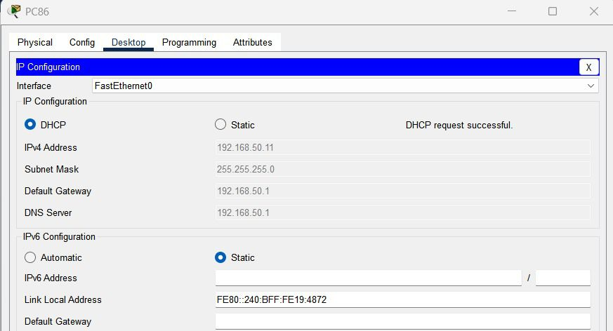

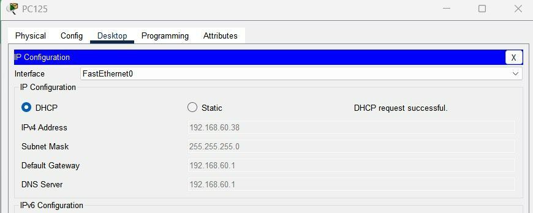

**Uji Konektivitas Ping**

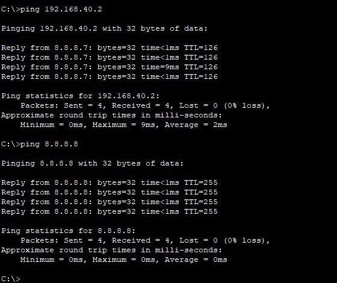
```bash
C:\>ping 192.168.40.2

Pinging 192.168.40.2 with 32 bytes of data:

Reply from 8.8.8.7: bytes=32 time<1ms TTL=126
Reply from 8.8.8.7: bytes=32 time<1ms TTL=126
Reply from 8.8.8.7: bytes=32 time=9ms TTL=126
Reply from 8.8.8.7: bytes=32 time<1ms TTL=126

Ping statistics for 192.168.40.2:

Packets: Sent = 4, Received = 4, Lost = 0 (0% loss), Approximate round trip times in milli-seconds:
Minimum = Oms, Maximum = 9ms, Average = 2ms

C:\>ping 8.8.8.8

Pinging 8.8.8.8 with 32 bytes of data:

Reply from 8.8.8.8: bytes=32 time<1ms TTL-255
Reply from 8.8.8.8: bytes=32 time<1ms TTL-255
Reply from 8.8.8.8: bytes=32 time<1ms TTL-255
Reply from 8.8.8.8: bytes=32 time<1ms TTL=255

Ping statistics for 8.8.8.8:

Packets: Sent = 4, Received = 4, Lost = 0 (0% loss), Approximate round trip times in milli-seconds:
Minimum = Oms, Maximum = Oms, Average = Oms

C:\>
```
Uji konektivitas *ping* yang dilakukan pada dua alamat IP, *192.168.40.2* dan *8.8.8.8*, menunjukkan bahwa koneksi jaringan berjalan dengan baik. Pada *ping* pertama ke *192.168.40.2*, balasan diterima dari *8.8.8.7*, yang menunjukkan adanya pengalihan melalui router atau server DNS. Waktu perjalanan data sangat cepat, dengan latensi antara <1ms hingga 9ms, dan tidak ada kehilangan paket (0% loss), menandakan koneksi yang stabil dalam jaringan lokal. Pada *ping* kedua ke *8.8.8.8*, DNS publik milik Google, balasan juga sangat cepat (<1ms) dengan TTL 255, menunjukkan koneksi luar jaringan yang lancar tanpa gangguan. Secara keseluruhan, kedua pengujian menunjukkan kinerja jaringan yang baik dan stabil, baik di dalam jaringan lokal maupun ke luar jaringan.

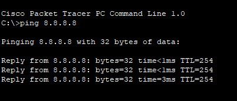
```bash
Cisco Packet Tracer PC Command Line 1.0 C:\>ping 8.8.8.8

Pinging 8.8.8.8 with 32 bytes of data:

Reply from 8.8.8.8: bytes=32 time<1ms TTL=254
Reply from 8.8.8.8: bytes=32 time<1ms TTL=254
Reply from 8.8.8.8: bytes=32 time=3ms TTL=254
```
Perintah *ping 8.8.8.8* yang dijalankan di Command Line pada Cisco Packet Tracer menguji konektivitas antara PC dan server 8.8.8.8, yang merupakan alamat IP dari server DNS publik Google. Hasil yang ditampilkan menunjukkan balasan dari server dengan ukuran data 32 byte pada setiap paket, dengan waktu respons yang sangat cepat (kurang dari 1ms pada dua percakapan pertama dan 3ms pada percakapan ketiga). Nilai TTL (Time to Live) yang tercatat adalah 254, yang menunjukkan bahwa paket dapat melewati beberapa hop jaringan sebelum mencapai tujuan. Secara keseluruhan, uji *ping* ini menunjukkan bahwa koneksi antara PC dan server 8.8.8.8 berjalan lancar tanpa gangguan atau kehilangan paket.


2. Implementasi DNS Server untuk resolusi nama internal.

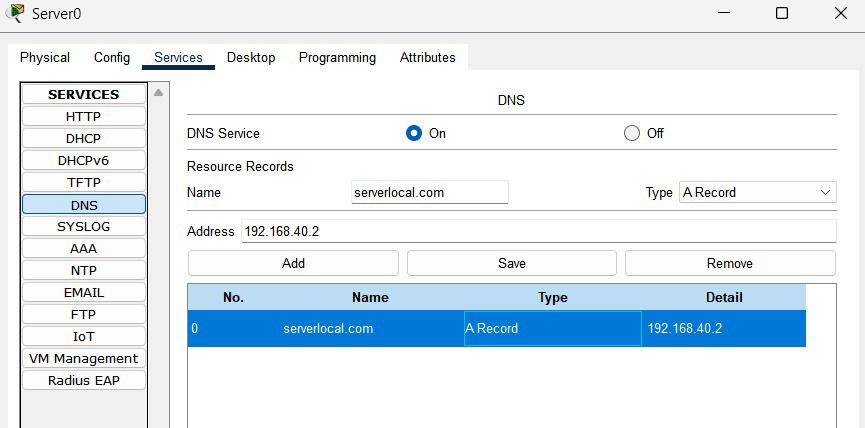

Gambar tersebut menggambarkan konfigurasi layanan DNS (Domain Name System) yang aktif pada sebuah server di aplikasi simulasi jaringan seperti Cisco Packet Tracer. Layanan DNS yang diaktifkan memungkinkan server untuk menerima permintaan dari klien dan menerjemahkan nama domain ke alamat IP. Konfigurasi mencakup entri A Record dengan nama domain *serverlocal.com* yang mengarah ke alamat IP *192.168.40.2*. Dengan adanya entri ini, klien dalam jaringan yang menggunakan server DNS ini dapat mengakses server dengan mengetikkan nama domain *serverlocal.com*, yang mempermudah akses tanpa perlu mengingat alamat IP. Tabel menunjukkan bahwa satu DNS record telah tersimpan, menghubungkan nama domain tersebut ke IP yang relevan.


3. Konfigurasi NAT untuk akses internet.
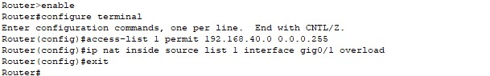
```bash
Router>enable
Router#configure terminal
Enter configuration commands, one per line. End with CNTL/Z.
Router(config)#access-list 1 permit 192.168.40.0 0.0.0.255
Router(config)#ip nat inside source list i interface gig0/1 overload
Router(config)#exit
Router#
```
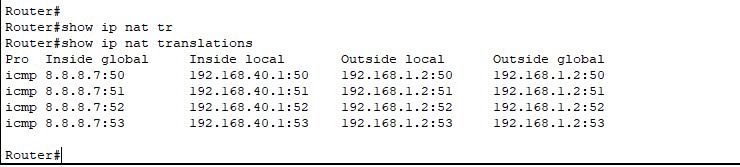
```bash
Router#
Router#show ip nat tr
Router#show ip nat translations

Pro Inside global        Inside Local              Outside local             Outside Global
icmp 8.8.8.7:50          192.168.40.1:50           192.168.1.2:50            192.168.1.2:50
icmp 8.8.8.7:51          192.168.40.1:51           192.168.1.2:51            192.168.1.2:51
icmp 8.8.8.7:52          192.168.40.1:52           192.168.1.2:52            192.168.1.2:52
icmp 8.8.8.7:53          192.168.40.1:53           192.168.1.2:53            192.168.1.2:53
Router#
```
Konfigurasi di atas mengatur NAT (Network Address Translation) tipe overload atau PAT (Port Address Translation) pada router Cisco, yang memungkinkan seluruh perangkat dalam jaringan lokal `192.168.40.0/24` untuk mengakses internet menggunakan satu IP publik pada interface `gig0/1`. Hal ini dilakukan dengan membuat access list yang mengizinkan jaringan lokal, lalu mengatur NAT agar menerjemahkan alamat IP internal ke IP global dengan membedakan koneksi berdasarkan port (overload). Hasilnya dapat dilihat melalui perintah `show ip nat translations`, yang menampilkan tabel terjemahan IP lokal ke IP global beserta nomor port yang digunakan, sehingga memungkinkan beberapa koneksi bersamaan menggunakan satu IP publik secara efisien.


  

