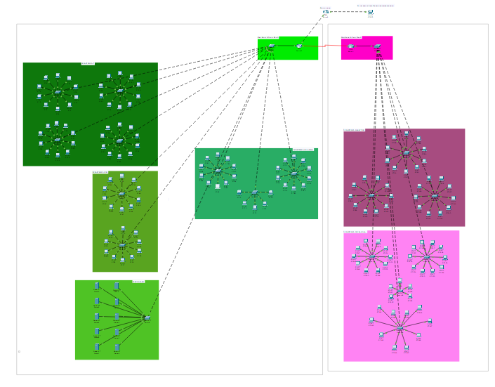
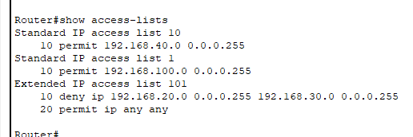
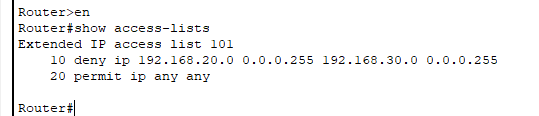
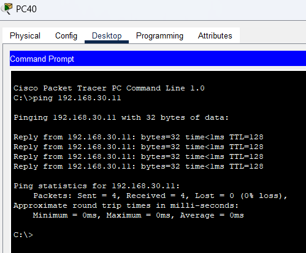

# [Implementasi Keamanan & Pengujian] - [Pekan 14]

## Anggota Kelompok dan Peran
- Meiske Handayani (10231052) - Network Architect
- Muhammad Ariel Rayhan (10231058) - Network Engineer
- Nilam Ayu Nandastari Romdoni (10231070) - Network service Specialist 
- Ranaya Chintya Mahitsa (10231078) - Security & Documentation Specialist 

## Isi Laporan





1. Standard IP Access List 10
- ACL: Standard IP access list 10
- Aturan ke-10: permit 192.168.40.0 0.0.0.255
Ini adalah aturan standar (standard ACL), yang hanya memeriksa sumber IP (source IP). Aturan ini mengizinkan semua lalu lintas dari subnet 192.168.40.0/24. Format 0.0.0.255 adalah wildcard mask yang berarti semua host dalam subnet tersebut.

2. Standard IP Access List 1
- Nama ACL: Standard IP access list 1
- Aturan ke-10: permit 192.168.100.0 0.0.0.255
Ini juga merupakan aturan standar. Aturan ini mengizinkan semua lalu lintas dari subnet 192.168.100.0/24 .Wildcard mask 0.0.0.255 menunjukkan bahwa semua host dalam subnet tersebut akan diizinkan.

3.Extended IP Access List 101
- Nama ACL: Extended IP access list 101
- Aturan ke-10: deny ip 192.168.20.0 0.0.0.255 192.168.30.0 0.0.0.255
Ini adalah aturan ekstensi (extended ACL), yang dapat memeriksa baik sumber IP maupun tujuan IP. Aturan ini menolak semua lalu lintas dari subnet 192.168.20.0/24 menuju subnet 192.168.30.0/24 . Wildcard mask 0.0.0.255 digunakan untuk menyatakan bahwa semua host dalam kedua subnet tersebut terlibat dalam aturan ini.
- Aturan ke-20: permit ip any any
Aturan ini mengizinkan semua lalu lintas lainnya (tidak termasuk yang ditolak oleh aturan sebelumnya). any any berarti semua sumber IP dan semua tujuan IP diizinkan.



Selanjutnya adalah memasukkan perintah Show access List 
```
Router>en
Router# show access list 101
    10 deny ip 192.168.20.0 0.0.0.255 192.168.30.0 0.0.0.255
    20 permit ip any any
Router#
```
Perintah diatas berfungsi untuk menampilkan aturan yang telah kita buat di ACL 101.


Langkah selanjutnya adalah melakukan ping, hasil atau output yang diberikan adalah sebagai berikut
```
PC40
Physical    Config    Desktop    Programming    Attributes

Command Prompt

Cisco Packet Tracer PC Command Line 1.0
C:\>ping 192.168.30.11

Pinging 192.168.30.11 with 32 bytes of data:
Reply from 192.168.30.11: bytes=32 time<1ms TTL=128
Reply from 192.168.30.11: bytes=32 time<1ms TTL=128
Reply from 192.168.30.11: bytes=32 time<1ms TTL=128
Reply from 192.168.30.11: bytes=32 time<1ms TTL=128

Ping statistics for 192.168.30.11:
    Packets: Sent = 4, Received = 4, Lost = 0 (0% loss),
Approximate round trip times in milli-seconds:
    Minimum = 0ms, Maximum = 0ms, Average = 0ms
C:\>
```

perintah ping dijalankan dari command prompt sebuah komputer (PC40) di Cisco Packet Tracer ke alamat IP 192.168.30.11 . Hasil menunjukkan bahwa sebanyak 4 paket ICMP berhasil dikirim dan semua paket diterima kembali dengan waktu respons kurang dari 1 milidetik , tanpa ada paket yang hilang (0% loss ). Nilai TTL (Time to Live) pada setiap balasan adalah 128 , yang umum digunakan oleh sistem operasi Windows, menunjukkan bahwa tujuan masih dalam jaringan lokal dan tidak melewati banyak hop. Dengan demikian, dapat disimpulkan bahwa koneksi jaringan antara sumber dan tujuan berjalan dengan baik, tanpa latensi atau gangguan, sehingga host tujuan dapat dijangkau secara stabil.