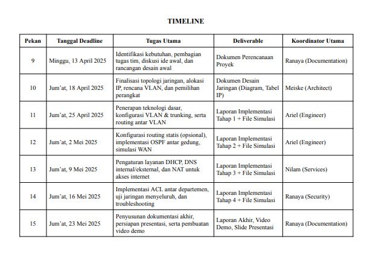
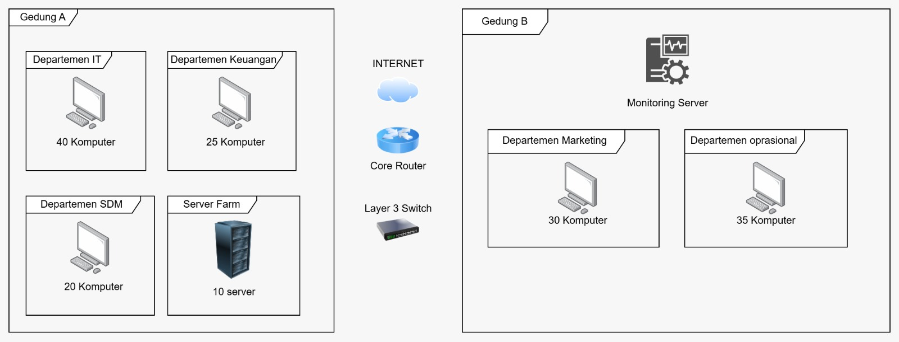

# [Perencanaan Proyek & Desain Awal] - [Pekan 9]

## Anggota Kelompok dan Peran
- Meiske Handayani (10231052) - Network Architect
- Muhammad Ariel Rayhan (10231058) - Network Engineer
- Nilam Ayu Nandastari Romdoni (10231070) - Network service Specialist 
- Ranaya Chintya Mahitsa (10231078) - Security & Documentation Specialist 

## Pendahuluan
[Latar belakang, tujuan, ruang lingkup]

## Isi Laporan
 **Dokumen Perencanaan Proyek**
  A. Analisis kebutuhan jaringan dari studi kasus.
  1. Segmentasi Jaringan (VLAN)
  Kebutuhan: Setiap departemen harus berada di VLAN terpisah. 

  Tujuan:
  - Isolasi antar departemen untuk mencegah akses tidak sah.
  - Pengelolaan trafik jaringan yang lebih baik.

  2. Koneksi Antar Gedung (WAN)
  Kebutuhan: Koneksi antara Gedung A (kantor pusat) dan Gedung B (kantor cabang) melalui teknologi WAN dengan bandwidth terbatas. 

  Tujuan:
  - Menghubungkan jaringan antar lokasi.
  - Pengaturan bandwidth efisien karena keterbatasan koneksi.

  3. Akses Internet (NAT)
  Kebutuhan: Implementasi NAT (Network Address Translation). 

  Tujuan:
  - Mengizinkan perangkat internal mengakses internet menggunakan IP publik yang terbatas.
  - Menjaga keamanan jaringan internal.

  4. Alokasi IP (DHCP)
  Kebutuhan: DHCP Server untuk setiap departemen. 

  Tujuan:
  - Otomatisasi pemberian IP address.
  - Mengurangi konfigurasi manual.

  5. Resolusi Nama (DNS)
  Kebutuhan: Layanan DNS internal dan eksternal. 
  
  Tujuan:
  - Memudahkan komunikasi antar perangkat dengan nama.
  - Mendukung layanan internal dan akses ke internet.

  6. Kontrol Akses (ACL)
  Kebutuhan: Access Control List.

  Tujuan:
  - Membatasi akses antar VLAN/departemen sesuai kebijakan.
  - Menambah lapisan keamanan jaringan.

  7. Routing Dinamis (OSPF)
  Kebutuhan: Routing OSPF antar gedung. 

  Tujuan:
  - Otomatisasi pengelolaan rute antar jaringan.
  - Adaptif terhadap perubahan topologi jaringan.

  8. Monitoring & Manajemen Terpusat
  Kebutuhan: Sistem monitoring dan manajemen jaringan. 
  
  Tujuan:
  - Deteksi dini masalah jaringan.
  - Sentralisasi kontrol untuk efisiensi pengelolaan

  B. Timeline rencana kerja untuk 7 pekan. 
  

  C. Sketsa awal desain jaringan (gambar yang diunggah dalam markdown dengan penjelasan detail).
  

- Terdapat komponen Internet yang berfungsi sebagai gateway utama bagi seluruh perangkat di jaringan internal 
- Komponen Router Utama berfungsi untuk pengelolaan traffic antar VLAN dan koneksi ke gedung cabang (WAN). Juga menjalankan OSPF sebagai routing dinamis.
- Komponen Layer 3 Switch yang nantinya akan ada di masing-masing departemen yang dipisah menggunakan VLAN. pada Gedung A  (VLAN 10, departemen IT, 40 komputer. VLAN 20 Departemen Keuangan, 25 Komputer. VLAN 30, Departemen SDM, 20 Komputer)
- Pada Gedung B  (VLAN 40 pada departemen Marketing dengan jumlah 30 komputer dan VLAN 50 pada departemen Operasional dengan 35 komputer)
